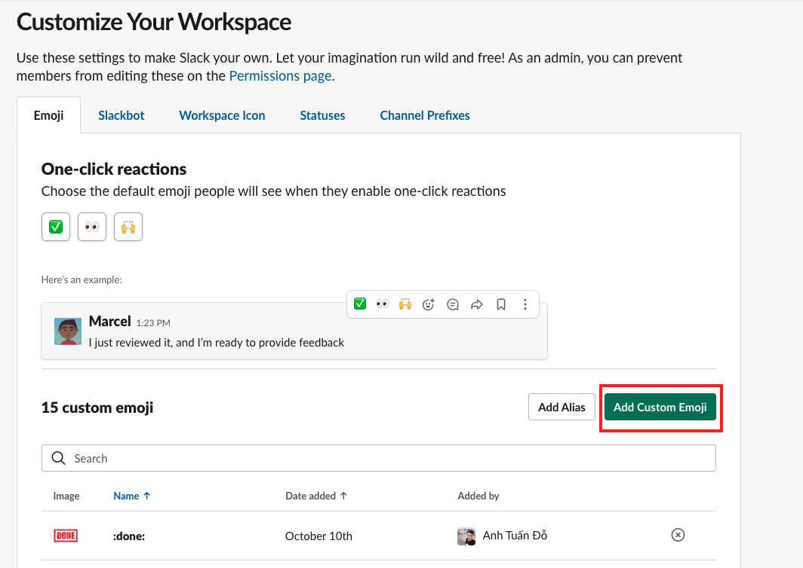
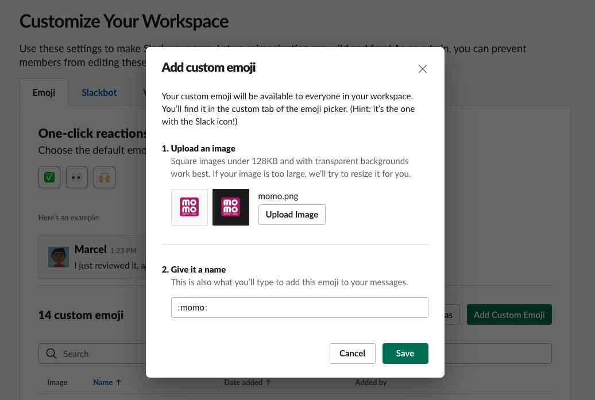

## Add custom emoji

The app using some custom emoij in message. If you want display theirs

1. Go to the link: https://slack.com/customize/emoji
2. Select the workspace do you want to add the emoji if you have more than 1 workspace. Almost people have only one.
3. Click to `Add Custom Emoji`

4. Download the file [img/emoji/momo.png](img/emoji/momo.png)
5. Upload to the form with name `momo`

6. Done